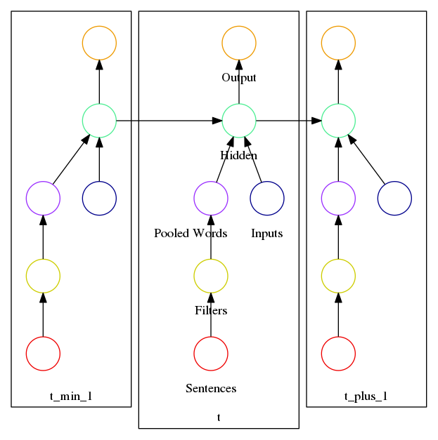

# Sequences-With-Sentences
Sequences With Sentences is a prototype of a convolutional recurrent neural network that can handle sequences with a mixture of fixed size and variable size (e.g., text) inputs at each time step. The LSTM portion of the code (which is the bulk of it) comes from the [WildML RNN Tutorial](https://github.com/dennybritz/rnn-tutorial-gru-lstm).

